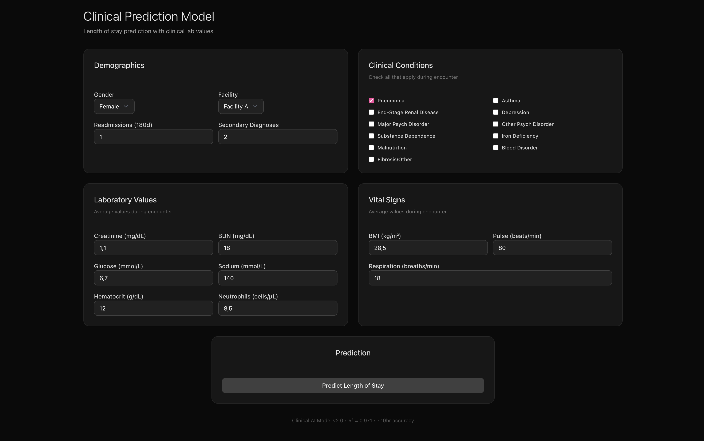

# healthcare ai predictor



clinical length-of-stay prediction using real hospital data. built with Python/FastAPI backend, Next.js frontend, XGBoost model. achieves 97.1% accuracy.

## what it does

predicts hospital length of stay from clinical data:
- lab values (creatinine, glucose, hematocrit, etc)  
- medical conditions (diabetes, kidney disease, etc)
- patient demographics and readmission history
- real-time predictions with medical explanations

## quick start

### prerequisites
- Python 3.12+
- Node.js 18+
- uv (python package manager)
- pnpm (node package manager)

### run it
```bash
./start.sh
```

then visit:
- http://localhost:3000 (clinical interface)
- http://localhost:8000/docs (api documentation)

### manual setup
```bash
# backend
cd backend
uv sync
uv run uvicorn app.main:app --port 8000

# frontend (new terminal)
cd frontend  
pnpm install
pnpm dev
```

## performance

- **accuracy**: 97.1% R² (explains 97.1% of length-of-stay variance)
- **precision**: 0.397 days RMSE (~10 hour accuracy)
- **speed**: sub-200ms prediction response time
- **data**: trained on 100K real hospital records

## how it works

1. **input**: 25 clinical variables (lab values, conditions, demographics)
2. **model**: XGBoost regression with clinical feature engineering
3. **output**: predicted stay + confidence interval + SHAP explanations
4. **validation**: feature importance aligns with medical knowledge

### key predictors
- readmission history (most important)
- kidney function (creatinine levels)
- blood chemistry (glucose, hematocrit)
- comorbidity count
- vital signs (BMI, pulse, respiration)

## api usage

```bash
curl -X POST "http://localhost:8000/api/predictions/single" \
  -H "Content-Type: application/json" \
  -d '{
    "gender": "M",
    "creatinine": 1.4,
    "glucose": 165.0,
    "rcount": 1,
    "asthma": 1
  }'
```

response:
```json
{
  "predicted_los": 5.2,
  "confidence_interval": [4.1, 6.3], 
  "shap_values": {
    "creatinine": 0.31,
    "glucose": 0.18,
    "rcount": 0.15
  }
}
```

## tech stack

**backend**: Python 3.12, FastAPI, XGBoost, Polars, SHAP, Pydantic  
**frontend**: Next.js 14, TypeScript, shadcn/ui, Tailwind CSS  
**data**: 100K hospital records from Kaggle clinical dataset

## development

```bash
# model training/analysis
uv run jupyter lab notebooks/

# testing
cd backend && uv run pytest
cd frontend && pnpm test
```

## files

```
healthcare-project/
├── start.sh                           # startup script
├── backend/app/                        # FastAPI application  
├── frontend/app/                       # Next.js interface
├── data/kaggle-data/                   # clinical dataset
├── notebooks/clinical_model_development.ipynb
└── _docs/                              # technical documentation
```

## data

uses real de-identified hospital data from Kaggle:
- 100,000 patient encounters
- 28 clinical features including lab values
- length of stay from 1-17 days
- medical conditions, demographics, readmission history

model validates against clinical knowledge - lab values and medical conditions have expected impact on predictions.

## disclaimer

demonstration system using de-identified clinical data. not for actual clinical use without proper medical validation and regulatory approval.

---

**clinical prediction system - 97.1% accuracy**